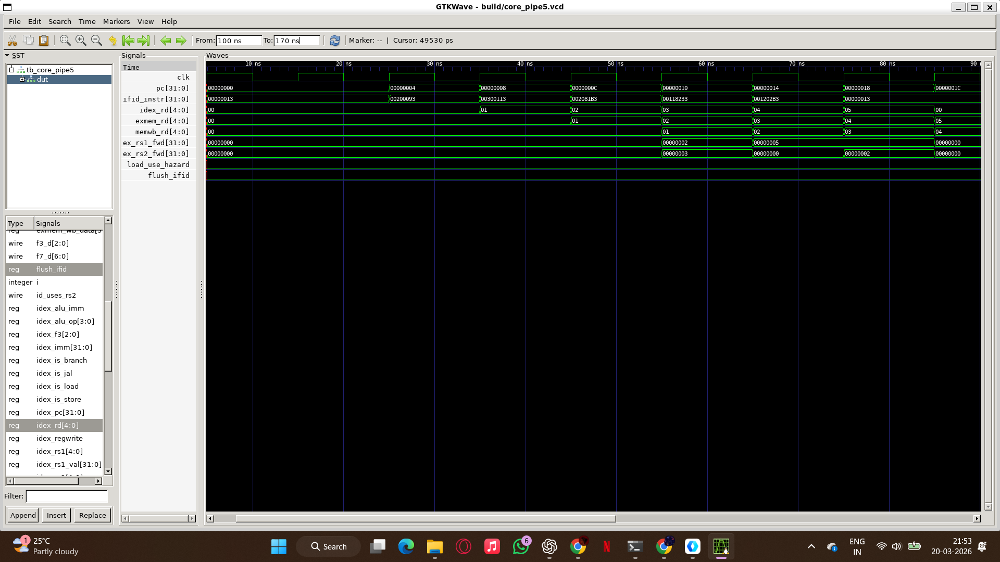
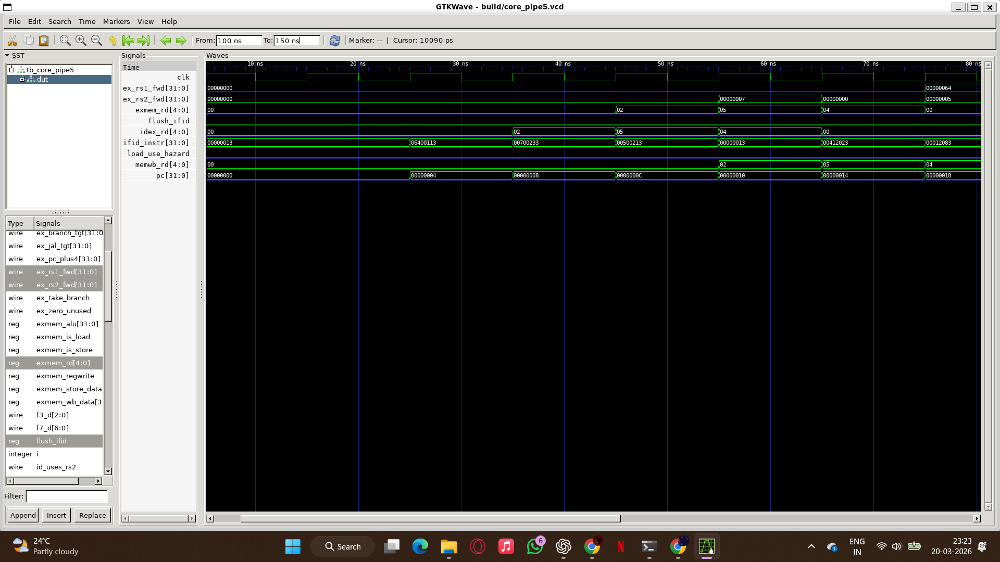

# RV32I 5-Stage Pipelined Processor (SystemVerilog)

This project implements a simple RV32I processor using a classic five-stage pipeline.
The design was written in SystemVerilog and verified using simulation with Icarus Verilog.

The goal of this project was to understand how pipelined processors work in practice,
including datapath design, hazard handling, and basic verification using directed tests.

---

## Pipeline Stages

The processor follows the standard five-stage pipeline structure.

| Stage | Description |
|------|-------------|
| IF | Instruction Fetch |
| ID | Instruction Decode and Register Read |
| EX | Execute (ALU operations) |
| MEM | Data Memory Access |
| WB | Write Back to Register File |

The program counter increments by 4 bytes for sequential instruction execution.

---

## Implemented Features

The processor supports a subset of the RV32I instruction set and includes:

- 5-stage pipelined datapath
- Register file (x0 hardwired to zero)
- Arithmetic and logical ALU operations
- Load and store instructions
- JAL (jump and link)
- Data hazard forwarding
- Load-use hazard stall logic
- Illegal instruction detection

---

## Hazard Handling

### Data Hazards (Forwarding)

Forwarding paths allow dependent instructions to use results from later pipeline
stages without waiting for writeback.

Example:

~~~text
add x1, x2, x3
add x4, x1, x5
~~~

The result from the first instruction is forwarded directly to the second instruction.

---

### Load-Use Hazard

If an instruction depends on a value loaded from memory,
the pipeline inserts a stall cycle.

Example:

~~~text
lw x5, 0(x1)
add x6, x5, x2
~~~

The dependent instruction waits until the loaded value becomes available.

---

### Control Hazards

When a branch is taken, instructions already in the pipeline are flushed
and execution resumes from the correct program counter.

---

## Verification

The processor was verified using directed simulation tests.

Each test loads a small RISC-V program into instruction memory and checks
the resulting register or memory state.

Test coverage includes:

- ALU operations
- Branch taken
- Branch not taken
- Forwarding hazards
- Load-use hazards
- Store forwarding
- Memory operations (LW/SW)
- JAL instruction
- Illegal instruction detection

All tests pass in the regression flow.

---

## Project Structure

~~~text
proj1_rv32i/
│
├── rtl/
│   ├── core_pipe5.sv
│   ├── core_single.sv
│   ├── regfile.sv
│   └── alu.sv
│
├── tb/
│   └── testbenches and directed test programs
│
├── scripts/
│   └── simulation and automation scripts
│
├── docs/
│   └── design notes
│
├── sim/
│   └── simulator configuration
│
├── Makefile
├── run_demo.sh
└── README.md
~~~

---

## Running the Project

Run the full verification suite:

~~~bash
make test
~~~

Run the short demo used for quick demonstrations:

~~~bash
./run_demo.sh
~~~

Example output:

~~~text
===== RV32I 5-Stage Pipeline Demo =====

[1/3] ALU test
PASS: x10=12

[2/3] Load-use hazard test
PASS

[3/3] Branch flush test
PASS

===== Demo complete =====
~~~
## Waveform Proof

### Forwarding Behavior

### Hazard Detection

---

## Tools Used

- SystemVerilog
- Icarus Verilog
- GTKWave
- Ubuntu / WSL

---

## Author

Sandeep Gorrepati
